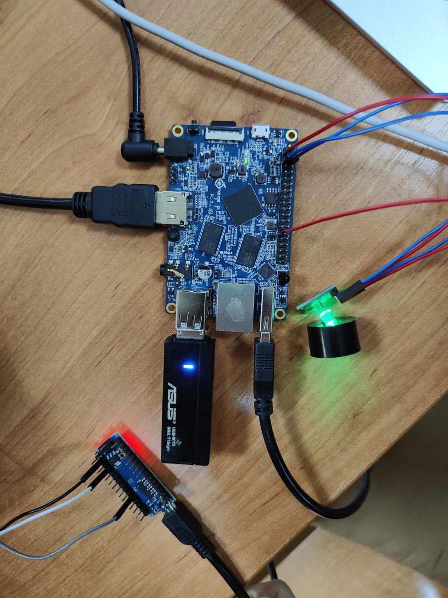

# Алкотестер

### Состав группы
| Номер | ФИО | Группа |
|:----|:-------------------------------------| :---      |
| 1   | **Кузнецов Николай Дмитриевич**      | АСУ-20-1б |
| 2   | **Брейкин Алексей Дмитриевич**       | АСУ-20-1б |
| 3   | **Чувашев Максим Алексеевич**        | АСУ-20-1б |

## Используемые инструменты

* OrangePI
* Arduino Nano
* Датчик паров (MQ-3)
* Светодиоды для индикации уровня алкоголя

## Список задач

- [x] Опробовать зажигание светодиодов, используя gpio
- [x] Подключить датчик алкоголя к Arduino Nano для считывания информации с него
- [x] Соединить Arduino Nano с OrangePI и заставить их обмениваться данными через серийный порт
- [x] Написать программу на Python 3.10

## Результат

В результате выполнения данной работы был получен алкотестер с использованием Orange PI вместе с модулем MQ-3.

